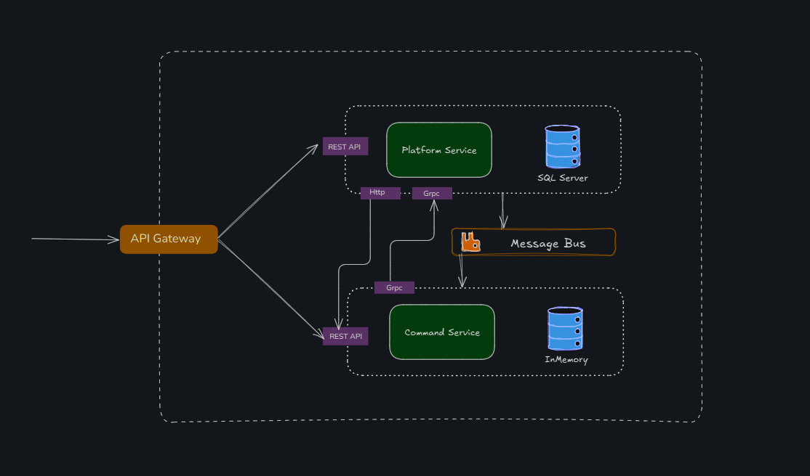
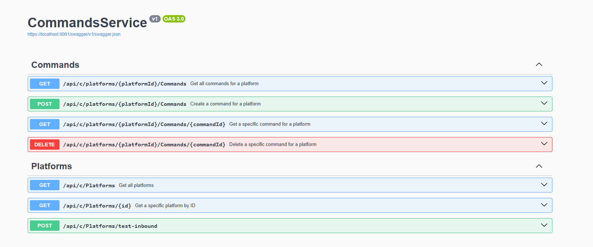
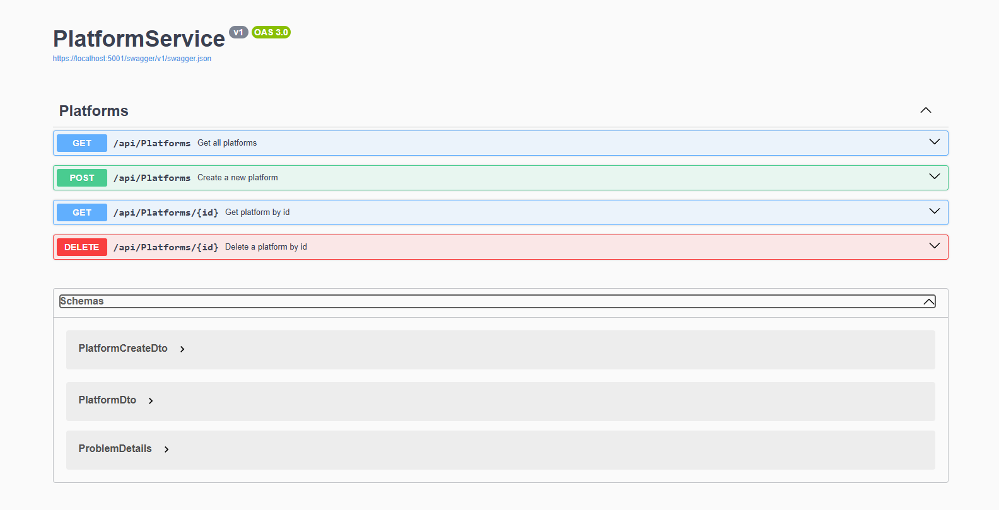

# Dotnet-Microservices

Minimal demo showing two .NET 9 microservices communicating via HTTP, gRPC and RabbitMQ.

Services:

- `PlatformService` — REST + gRPC, publishes events to RabbitMQ
- `CommandsService` — REST, subscribes to RabbitMQ and seeds data via gRPC

Kubernetes manifests are available in `K8S/` for optional deployment.

## Endpoints overview

